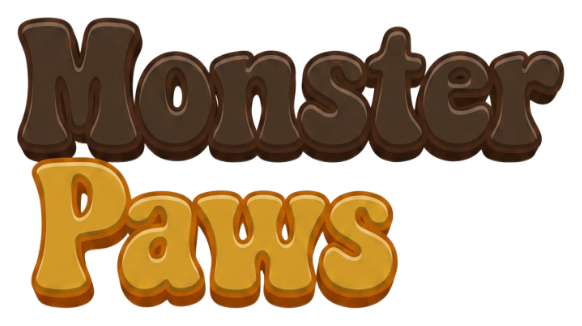

<p align="center">
  
</p>

<p align="center"><em>every monster deserves a happy ending</em></p>

**Monster Paws** is a free website where you sponsor a real shelter animal,
collect their story, and cheer them all the way to adoption day. **100% of
every donation goes to the animal's shelter** via [Every.org](https://www.every.org)
— we never take a cut, run ads, or process payments.

What makes it different: **provenance**. Shelters cryptographically sign
attestations of real care events ("Biscuit received a dental on March 14"),
so donors see exactly what their support did — verifiable without trusting
us or our database. Sponsorship with receipts, never "buy a slice of a dog."

[](https://github.com/LoganBresnahan/monster-paws/actions/workflows/ci.yml)

## Status

Pre-launch, building in public. `doc/roadmap.md` is the build order;
`doc/DIRECTION.md` is the product source of truth; every decision has an
ADR in `doc/adr/`.

## Mission & bright lines

**Inspire joy.** And some things we will never do: no rarity tiers on
animals, nothing tradeable, no dark-pattern pressure, no programmatic ads,
and generated donor updates never claim care that isn't attested.

## Stack

Full-stack TypeScript: Next.js (App Router) + Postgres (the platform:
relational + append-only event log + JSONB corpus + pgvector + pg-boss
jobs) + Drizzle, on a single DigitalOcean droplet behind Cloudflare, images
in R2. AI keepsake art via Replicate behind a provider interface, generated
only on donation and only with shelter consent. Details: `CLAUDE.md`,
`doc/infra.md`, ADRs 0001–0008.

## Development

```sh
npm install
npm run dev        # http://localhost:3000
npm test           # vitest units
npm run typecheck
npm run e2e        # Playwright (boots the dev server)
npm run db:up      # local Postgres (docker, pgvector)
```

See [CONTRIBUTING.md](CONTRIBUTING.md).

## License

Code: [AGPL-3.0](LICENSE). The Monster Paws name and brand assets are
**not** licensed — see [TRADEMARKS.md](TRADEMARKS.md).
